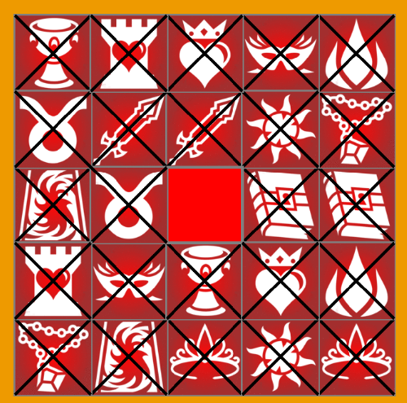

# Matching Game
Python-generated graphics memorization game. With this program, the user is given a board of 12 pairs of matching cards, with randomized wild card at the beginning of each new game. The program will cross out if it is a match is found; matched pairs will stay on the board, and flip upside down if the match is not found.
The game will flash bright colors once all 12 pairs are found and the wild card remains faced down.

This is an entry-level project to show off student's proficency with simple python commands and graphic packages. This project is used to test the students knowledge of adding their own icons and changing the color scheme of the demo-given game to give it a personalized touch.

